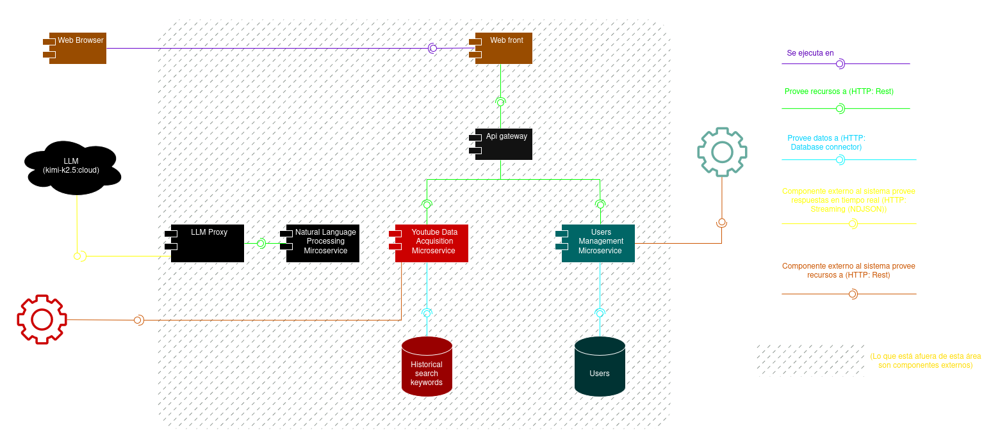
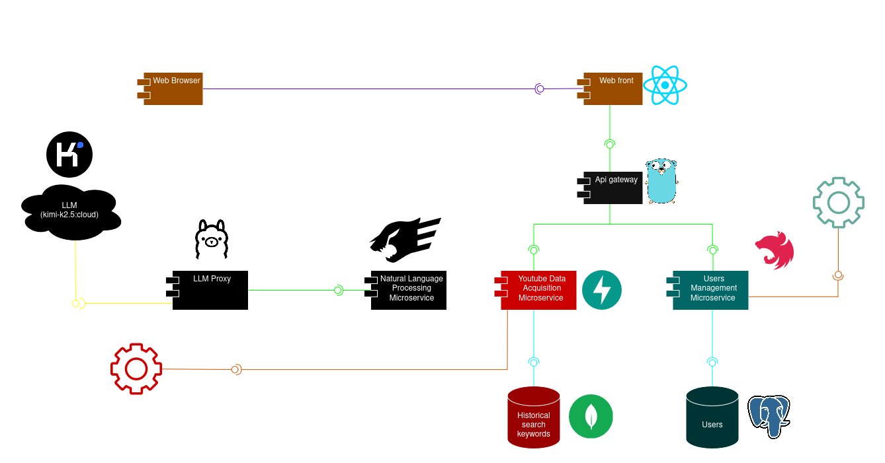

# Artifact - Prototipo 1 - RacconAnalytics

## Grupo 2F

- Juan David Buitrago Salazar
- Juan David Serrano Ruiz
- Federico Hernández Montaño
- Johan Stiven Sarmiento Torres
- Daniela Ariadna Rueda Hernández
- Luis David Garzón Morales
- Miguel Angel Citarella Camargo
- David Felipe Chaparro Pérez
- Andrés Felipe León Sánchez

## Software system
### Name

Raccon Analytics

### Logo


### Description

El proyecto consiste en el desarrollo de una aplicación web orientada al análisis de tendencias de contenido en plataformas digitales. El sistema permitirá a los usuarios realizar búsquedas sobre temas específicos y visualizar indicadores que reflejen el nivel de actividad, popularidad y relevancia del tema dentro de distintas plataformas sociales. En el primer prototipo del sistema, el análisis se enfocará principalmente en contenido proveniente de YouTube

El funcionamiento general de la aplicación se basa en que el usuario ingresa una consulta relacionada con un tema de interés. A partir de esta consulta, el sistema realizará solicitudes a las APIs disponibles de las plataformas objetivo y recopilará información sobre contenido relacionado con dicha búsqueda. Posteriormente, la aplicación procesará los resultados obtenidos para generar estadísticas básicas que permitan evaluar la relevancia del tema dentro de cada plataforma.

El propósito de la plataforma no es únicamente mostrar resultados de búsqueda, sino ofrecer una visión agregada del comportamiento del contenido asociado a un tema. Esto permitirá identificar tendencias, evaluar la popularidad de ciertos tópicos y detectar contenido relevante dentro de comunidades digitales.

El alcance del primer prototipo del sistema estará limitado a la recopilación y análisis de métricas básicas disponibles a través de las APIs públicas de las plataformas seleccionadas. Debido a las restricciones propias de estas APIs, tales como límites diarios de consultas o disponibilidad limitada de ciertos tipos de información, el sistema priorizará la obtención de datos esenciales que permitan generar indicadores representativos del comportamiento del contenido.


## Architectural Structures

### Component-and Connector (C&C) Structure

#### C&C View:



#### Architectural styles

La aplicación emplea un estilo arquitectónico de Microservicios, caracterizado por su naturaleza distribuida y el alto grado de autonomía de sus componentes. La comunicación externa se gestiona mediante el patrón API Gateway, que actúa como un punto de entrada único para el front-end, desacoplando la capa de presentación de la lógica interna del sistema.

Este diseño permite la orquestación y el enrutamiento hacia servicios especializados que operan de manera independiente y poseen su propia persistencia de datos:

- *Servicio de Adquisición de Datos de YouTube:* Se encarga de capturar información en tiempo real (tendencias, títulos y métricas) mediante la integración con la API externa de YouTube. Este componente se apoya en un pipeline de Procesamiento de Lenguaje Natural (NLP) y proxies de LLM para el análisis avanzado de los datos obtenidos.

- *Servicio de Gestión de Usuarios:* Administra el ciclo de vida de las cuentas, permitiendo el registro y la autenticación de usuarios de forma aislada, garantizando que la lógica de identidad no interfiera con las funciones de búsqueda.

Los componentes son reutilizables, escalables independientemente y se comunican principalmente a través de protocolos ligeros (HTTP: REST y Streaming), lo que refuerza la agilidad y el bajo acoplamiento del sistema.

#### Architectural elements and relations

Nuestro sistema cuenta con 1 componente de presentación (Frontend web), 1 punto de entrada y enrutamiento (API Gateway), 4 componentes lógicos (Users Management Service, Youtube Data Acquisition Service, Natural Language Processing Service, LLM Proxy), 2 bases de datos (Historical search keywords y Users), y 3 componentes externos (Browser, LLM, External Youtube API).

*Capa de Presentación:* Se limita a la interfaz web, cuya responsabilidad es renderizar la información suministrada por los servicios lógicos a través del API Gateway.

*API Gateway:* Actúa como mediador, manejando las peticiones hacia el servicio de adquisición de YouTube y el de gestión de usuarios. Provee una interfaz unificada para el frontend, ocultando la complejidad de la arquitectura distribuida.

*Servicios Lógicos:*

- *Users Management Service:* Gestiona el ciclo de vida de los usuarios (registro e inicio de sesión), exponiendo recursos de autenticación.

- *Youtube Data Acquisition Service:* Orquesta la extracción de datos externos. Procesa la query del usuario, consulta la API de YouTube y enriquece los resultados mediante el servicio de NLP.

- *Natural Language Processing Service:* Implementa la lógica de IA. Diseña prompts específicos, limpia las respuestas del LLM y estructura la información para los servicios de extracción.

- *LLM Proxy (Ollama):* Actúa como puente técnico para la ejecución del modelo, abstrayendo la complejidad de las llamadas al LLM y gestionando el envío/recepción de prompts.

*Persistencia:*

- *Historical search keywords (NoSQL):* Funciona como una capa de persistencia para queries previas, optimizando el rendimiento y reduciendo el consumo de la API de YouTube.

- *Users:* Repositorio centralizado para la información básica y credenciales de acceso de los usuarios.



## Prototype
### Intructions

*Prerrequisitos:* 

Se deben tener las siguientes aplicaciones instaladas en el sistema:
- Node.js 
- npm
- Python 3.11 (o una versión más actualizada)
- Ollama con una cuenta asociada
- Gestor de paquetes pip
- Docker 

*Pasos para despliegue:*

1. Clonar el repositorio principal:

```bash
git clone https://github.com/RacconAnalytics/prototype-1.git
```

2. en cada una de las carpetas de los componentes del proyecto, clonar el repositorio de cada componente (en caso de que el anterior comando no lo haya hecho):

```bash
git clone https://github.com/RacconAnalytics/api-gateway.git
git clone https://github.com/RacconAnalytics/NLP-service.git
git clone https://github.com/RacconAnalytics/users-service.git
git clone https://github.com/RacconAnalytics/web-page.git
git clone https://github.com/RacconAnalytics/youtube-acquisition-service.git
```

3. Ajustar las variables de entorno en cada uno de los componentes. En cada uno de los repositorios se encuentra la estructura de ejemplo del `.env`. Tambien se incluye un .env con credenciales para facilitar su despliegue en etapas tempranas del desarrollo.

4. Ejecutar docker compose:

```bash
docker compose up -d --build
```

- Acceder a la interfaz web con su navegador de preferencia, a la URL:

**http://localhost:5173**

